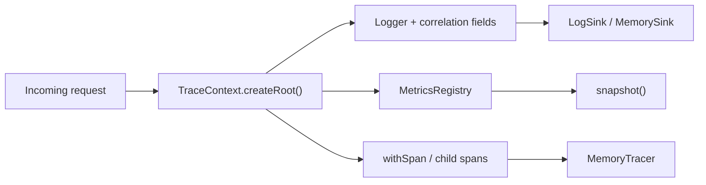

# @aadiaiagent/observability-kit

**Staff / platform observability primitives for Node** — structured logging, counters & histograms, and correlated traces — without OpenTelemetry baggage or vendor SDKs.

Built as an interview-sized library: readable in one sitting, production-shaped APIs, in-memory exporters for demos and tests. No API keys. Node 20+, ESM, MIT.

## Why this exists

Hiring managers evaluating platform / Staff SWE candidates often want to see:

- **Correlation-first design** — every log line and span share a `traceId`
- **Clean boundaries** — `LogSink` / `SpanExporter` interfaces instead of hard-wired vendors
- **Testability** — `MemorySink` + `MemoryTracer` + `MetricsRegistry.snapshot()`
- **Judgment** — deliberately *not* wrapping OTel until an adapter is justified

This kit is that slice.

## Architecture



A single request creates a root `TraceContext`. Child spans and a child `Logger` inherit the same `traceId`. Metrics stay orthogonal but share naming conventions (`http_*`, `db_*`).

## Quickstart

```bash
npm install
npm run typecheck
npm test
npm run example
```

```ts
import {
  Logger,
  MemorySink,
  MetricsRegistry,
  TraceContext,
  MemoryTracer,
} from '@aadiaiagent/observability-kit';

const sink = new MemorySink();
const tracer = new MemoryTracer();
const metrics = new MetricsRegistry();

const root = TraceContext.createRoot({ tracer });
const log = new Logger({
  level: 'info',
  sink,
  defaultFields: root.correlationFields(),
});

await root.withSpan('GET /health', async (ctx) => {
  log.child(ctx.correlationFields()).info('ok', { status: 200 });
  metrics.counter('http_requests_total').inc();
  metrics.histogram('http_latency_ms').observe(4);
});
```

## Design choices

| Choice | Rationale |
|--------|-----------|
| **No OTel dependency** | Keeps the surface interview-sized; adapter on the roadmap |
| **Correlation first** | `traceId` / `spanId` on every log via `correlationFields()` |
| **Pluggable sinks** | Console today, Memory for tests, HTTP/file later — no vendor lock-in |
| **In-memory exporters** | Deterministic unit tests; demos need zero infra |
| **ESM + NodeNext** | Matches modern Node 20+ library packaging |

## Layout

```
src/
  types.ts                 Shared interfaces
  logger/Logger.ts         Structured logger + MemorySink
  metrics/MetricsRegistry.ts
  tracing/TraceContext.ts  createRoot / child / withSpan + MemoryTracer
  index.ts                 Public exports
tests/                     vitest coverage
examples/basic.ts          End-to-end demo
```

## API sketch

- **`Logger`** — `info` / `warn` / `error` / `debug` with fields, level filter, `child()`, `LogSink`
- **`MetricsRegistry`** — `counter(name).inc(n?)`, `histogram(name).observe(v)`, `snapshot()`
- **`TraceContext`** — `createRoot()`, `child()`, `withSpan(name, fn)`, `correlationFields()`

## Roadmap

- [ ] OpenTelemetry adapter (`SpanExporter` → OTLP)
- [ ] AsyncLocalStorage context propagation helper
- [ ] Prometheus text exposition for `snapshot()`
- [ ] Sampling / redaction hooks on `LogSink`

## License

MIT © 2026 aadiaiagent-max
